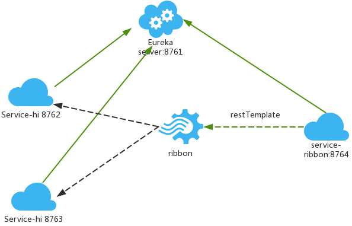

# 服务消费者(rest+ribbon)
在微服务架构中，业务都会被拆分成一个独立的服务，服务与服务的通讯是基于http restful的，Spring cloud有两种服务调用方式，一种是ribbon+restTemplate，另一种是feign。

## ribbon简介
ribbon是一个负载均衡客户端，可以很好的控制htt和tcp的一些行为。

## 准备工作

* 启动eureka-server 工程；启动service-hi工程，它的端口为8762；将service-hi的配置文件的端口改为8763,并启动，这时你会发现：service-hi在eureka-server注册了2个实例，这就相当于一个小的集群。访问localhost:8761。

* 一个工程如何启动多个实例->在idea上点击Application右边的下三角，弹出选项后，点击Edit Configuration，打开配置后，将默认的Single instance only(单实例)的钩去掉，通过修改application文件的server.port的端口，启动。多个实例，需要多个端口，分别启动。

## 建一个服务消费者
* 重新新建一个spring-boot工程，取名为：service-ribbon; 在它的pom.xml文件分别引入起步依赖spring-cloud-starter-eureka、spring-cloud-starter-ribbon、spring-boot-starter-web.配置文件

* application.yml如下:

  ```yml
  eureka:
    client:
      serviceUrl:
        defaultZone: http://localhost:8761/eureka/
  server:
    port: 8764
  spring:
    application:
      name: service-ribbon
  ```

* 在工程的启动类中,通过@EnableDiscoveryClient向服务中心注册；并且向程序的ioc注入一个bean: restTemplate;并通过@LoadBalanced注解表明这个restTemplate开启负载均衡的功能。

* 写一个测试类HelloService，通过之前注入ioc容器的restTemplate来消费service-hi服务的“/hi”接口，在这里我们直接用的程序名替代了具体的url地址，在ribbon中它会根据服务名来选择具体的服务实例，根据服务实例在请求的时候会用具体的url替换掉服务名。

* return restTemplate.getForObject("http://SERVICE-HI/hi?name="+name,String.class),其中String.class代表请求返回的类型.
在浏览器上多次访问http://localhost:8764/hi?name=forezp，浏览器交替显示：

  ```yml
  hi forezp,i am from port:8762
  hi forezp,i am from port:8763
  ```

* 这说明当我们通过调用restTemplate.getForObject(“http://SERVICE-HI/hi?name=“+name,String.class)方法时，已经做了负载均衡，访问了不同的端口的服务实例。

## ribbon负载均衡架构


* 一个服务注册中心，eureka server，端口号为8761
* service-hi工程跑了两个实例，端口号为8762、8763,分别向服务注册中心注册
* sercvice-ribbon端口为8764,向服务注册中心注册
* 当sercvice-ribbon通过restTemplate调用service-hi的hi接口时，因为用ribbon进行了负载均衡，会轮流的调用service-hi：8762和8763 两个端口的hi接口；